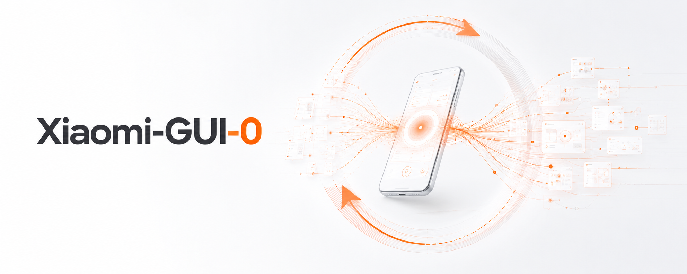

<div align="center">



### An End-to-End Multimodal GUI Agent for Real Mobile Environments

*Trained and evaluated in a **real-device closed loop** — closing the benchmark-to-reality gap.*

<p>
  <a href="https://seerray-lab.github.io/Xiaomi-GUI-0/"></a>
  <a href="https://huggingface.co/collections/SeerRay-Lab/xiaomi-gui-0"></a>
  <a href="https://github.com/SeerRay-Lab/Xiaomi-GUI-0"></a>
</p>

</div>

## 📰 News

- **2026-06** — 🚀 Released the **Xiaomi-GUI-0** technical report, code, and evaluation suites.
- **2026-06** — 🧪 Released [**RealMobile**](https://huggingface.co/datasets/SeerRay-Lab/RealMobile-BMK), a real-device benchmark across 14 live apps with sub-goal scoring.
- **2026-06** — 🌐 Launched the [project page](https://seerray-lab.github.io/Xiaomi-GUI-0/) and the [HuggingFace collection](https://huggingface.co/collections/SeerRay-Lab/xiaomi-gui-0).

## ✨ What Is Xiaomi-GUI-0?

High benchmark scores do not reliably predict performance on real devices, where account states, permission dialogs, payment authentication, and risk-control mechanisms continually reshape the state distribution a GUI agent encounters. To close this gap, **Xiaomi-GUI-0** is a native end-to-end multimodal GUI agent for real mobile environments, trained and evaluated within a **real-device closed loop**:

- **📱 Real-device-dominant infrastructure**: hundreds of physical phones, tablets, and in-vehicle cockpits, complemented by sandboxes, so collection, training, and evaluation share one real-deployment distribution.
- **🔁 Error-driven data flywheel**: failure trajectories from real rollouts are converted into corrected actions, reflective rationales, and recovery demonstrations.
- **🎯 Progressive three-stage training**: SFT → Step RL → Agentic RL incrementally builds basic interface operation, long-horizon planning, and error recovery.
- **🧪 RealMobile benchmark**: 100 real-device tasks across 14 live apps, scored by fine-grained sub-goals, with 57% spanning multiple applications.

## 📊 Main Results

> Success: fraction of fully completed tasks; Progress: mean fraction of completed sub-goals per task.

| Model | RealMobile&nbsp;Success | RealMobile&nbsp;Progress | AndroidWorld |
|---|:---:|:---:|:---:|
| Gemini 3.1 Pro | 85.0% | 89.6% | — |
| Gemini 3.1 Flash | 58.0% | 72.4% | — |
| Claude Opus 4.7 | 60.0% | 74.8% | — |
| Seed 2.0 Pro | 80.0% | 88.1% | — |
| Seed 1.8 | 65.0% | 82.4% | 70.7% |
| UI-TARS-2 | — | — | 73.3% |
| UI-TARS-1.5 | 24.0% | 40.5% | 64.2% |
| UI-Venus-1.5-30B-A3B | 21.0% | 44.6% | 77.6% |
| GUI-Owl-1.5-32B-Instruct | 22.0% | 40.6% | 69.8% |
| GUI-Owl-1.5-32B-Thinking | 31.0% | 51.7% | 69.8% |
| Step-GUI-8B | 15.0% | 32.8% | 67.7% |
| MAI-UI-8B | 33.0% | 50.8% | 70.7% |
| **Xiaomi-GUI-0-30B-A3B** | **72.0%** | **85.8%** | **78.9%** |

## 🧪 The RealMobile Benchmark

RealMobile is built from real user traffic, hand-crafted for reproducible evaluation, and executed on **physical devices against live applications** rather than emulators. Each task is scored through **fine-grained sub-goals** that award partial credit, and most tasks span **multiple applications**.

| Domain | Tasks | Avg. Apps | Multi-App Ratio | Focus |
|---|:---:|:---:|:---:|---|
| Foundation | 10 | 1.30 | 10% | Basic GUI operations: clicking, scrolling, inputting, and navigating across interfaces. |
| Safety & Reflection | 16 | 1.31 | 31% | Refusing unsafe or irreversible operations, and recognizing infeasible goals to stop or skip. |
| Memory & Knowledge | 33 | 1.73 | 58% | Retaining information across steps and applying external knowledge to complete tasks. |
| Complex Reasoning & Planning | 41 | 2.49 | 78% | Long-horizon planning, multi-source aggregation, and adaptive decision-making. |
| **Overall** | **100** | **1.93** | **57%** | |

<div align="center">
  
  
</div>

## 🗂️ Components

One agent model, evaluated three ways and shipped as a product. Each directory has its own README with full setup and usage.

| Directory | Role | Highlights |
|---|---|---|
| [`guiness/`](guiness/) | Desktop client that runs the agent on a real phone | PySide6 + Android companion; WiFi (no ADB) or USB; interactive + batch eval; adapters for Gemini / Claude / GPT / Doubao / AutoGLM / Step-GUI / Xiaomi-GUI-0 |
| [`android_world_eval/`](android_world_eval/) | Dynamic emulator benchmark | Vision-only AndroidWorld, 116 tasks / 20 apps; `<think>→<action>→<tool_call>`; checkpoint/resume |
| [`grounding-eval/`](grounding-eval/) | Static grounding benchmark | 5 datasets (ScreenSpot, ScreenSpot-V2, MMBench-GUI, OSWorld-G, OSWorld-G-Refine); distributed via torchrun |
| [`RealMobile/`](RealMobile/) | Real-phone Chinese-app benchmark | XPath rule-based scoring of recorded trajectories; PaddleOCR-augmented UI XML |
| [`demo/`](demo/) | Sample trajectories (data only) | AndroidWorld episodes: `task.json` + per-step screenshots |

## 📚 Reference

If you find the resources in this repository helpful, please cite as:

```bibtex
@techreport{xiaomigui0_2026,
  title        = {Xiaomi-GUI-0 Technical Report},
  author       = {},
  institution  = {Xiaomi},
  year         = {2026},
  url          = {https://github.com/SeerRay-Lab/Xiaomi-GUI-0}
}
```

<div align="center">
<sub>Visit the <a href="https://seerray-lab.github.io/Xiaomi-GUI-0/">project page</a> for demos, full results, and updates.</sub>
</div>
